# SESI 1 - PERSIAPAN PROYEK

## Tujuan
Memahami konsep dasar MVC dan menyiapkan struktur awal project PHP MVC.

---

# Struktur Folder

```bash
mvc_mahasiswa_kelompok7/
│
├── app/
│   ├── controllers/
│   ├── models/
│   ├── views/
│
├── config/
├── core/
├── public/
├── .htaccess
└── README.md
```

---

# SESI 3 - MODEL DAN TAMPIL DATA MAHASISWA

## Tujuan
Membuat model Mahasiswa, menambahkan data dummy, dan menampilkan data mahasiswa ke dalam tabel.

---

## Langkah Pengerjaan

### 1. Membuat Model Mahasiswa
Membuat file:

```bash
app/models/Mahasiswa.php
```

Model digunakan untuk mengambil data mahasiswa dari database menggunakan PDO.

Method yang dibuat:

```php
getAll()
```

Method ini menjalankan query:

```sql
SELECT * FROM mahasiswa ORDER BY id DESC
```

---

### 2. Menambahkan Data Dummy
Menambahkan minimal 5 data mahasiswa ke database menggunakan SQL.

Data berisi:
- NPM
- Nama Lengkap
- Fakultas
- Jurusan
- Tempat Lahir
- Tanggal Lahir
- Jenis Kelamin

---

### 3. Membuat MahasiswaController
Membuat file:

```bash
app/controllers/MahasiswaController.php
```

Method:

```php
index()
```

Method ini digunakan untuk:
- memanggil model Mahasiswa
- mengambil seluruh data mahasiswa
- mengirim data ke view

---

### 4. Membuat View Mahasiswa
Membuat file:

```bash
app/views/mahasiswa/index.php
```

Data mahasiswa ditampilkan dalam bentuk tabel HTML.

Kolom tabel:
- No
- NPM
- Nama Lengkap
- Fakultas
- Jurusan
- Tempat Lahir
- Tanggal Lahir
- Jenis Kelamin
- Status

---

## Hasil Sesi 3

- Model Mahasiswa berhasil dibuat
- Data dummy berhasil ditambahkan
- Data mahasiswa berhasil ditampilkan
- Tabel mahasiswa tampil di browser

---

# Screenshot

## Tabel Data Mahasiswa

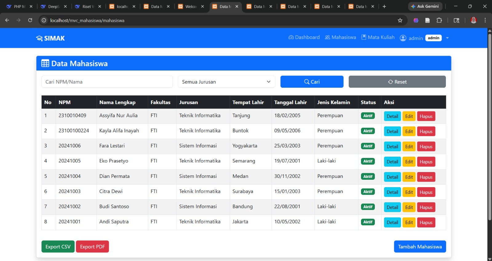

---

# URL Testing

```bash
http://localhost/mvc_mahasiswa_kelompok7/public/mahasiswa
```

---

# Commit GitHub

```bash
git add .
git commit -m "Sesi 3 - model dan tampil data"
git push origin main
```
# Langkah Pengerjaan

## 1. Membuat Struktur Folder
Membuat folder MVC sesuai modul praktikum:
- controllers
- models
- views
- config
- core
- public

---

## 2. Membuat File .htaccess
Digunakan untuk URL rewriting agar routing berjalan dengan baik.

### Root .htaccess

```apache
RewriteEngine On
RewriteCond %{REQUEST_FILENAME} !-f
RewriteCond %{REQUEST_FILENAME} !-d
RewriteRule ^(.*)$ public/index.php?url=$1 [QSA,L]
```

### Public .htaccess

```apache
Options -MultiViews
RewriteEngine On
RewriteCond %{REQUEST_FILENAME} !-f
RewriteCond %{REQUEST_FILENAME} !-d
RewriteRule ^(.*)$ index.php?url=$1 [QSA,L]
```

---

## 3. Membuat Koneksi Database

Database yang digunakan:

```sql
uniska_latihan_mvc_2026
```

Menggunakan PDO untuk koneksi database MySQL.

---

## 4. Membuat Tabel Mahasiswa

Tabel utama bernama:

```sql
mahasiswa
```

Berisi data:
- npm
- nama_lengkap
- fakultas
- jurusan
- tempat_lahir
- tanggal_lahir
- jenis_kelamin

---

## 5. Testing Database

Membuat file:

```bash
public/test_db.php
```

Untuk mengecek apakah koneksi database berhasil.

Hasil yang tampil di browser:

```text
Koneksi berhasil
```

---

# Hasil Sesi 1

- Struktur folder berhasil dibuat
- Database berhasil dibuat
- Koneksi database berhasil
- Project berhasil dijalankan di localhost

---

# Screenshot

## Struktur Folder VSCode

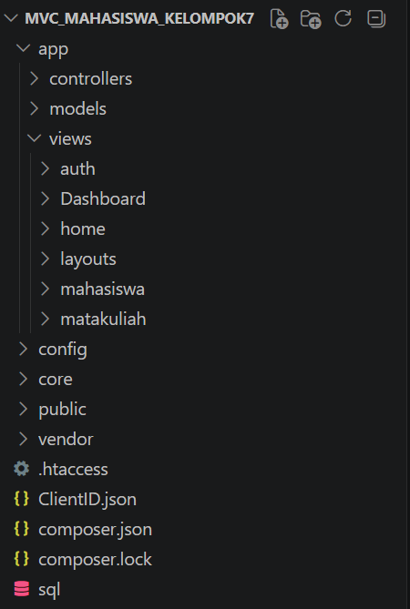

## Test Database

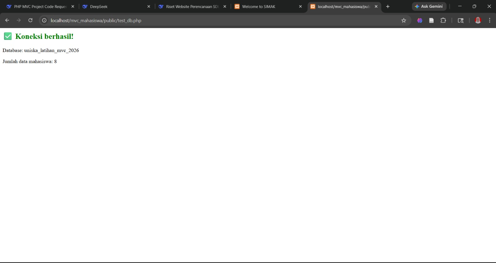

---

# Commit GitHub

```bash
git add .
git commit -m "Sesi 1 - persiapan proyek"
git push origin main
```

# SESI 2 - ROUTING DAN BASE CONTROLLER

## Tujuan
Memahami cara kerja routing pada arsitektur MVC dan membuat Base Controller yang digunakan oleh seluruh controller.

---

## Langkah Pengerjaan

### 1. Membuat Router
Membuat file `core/Router.php` untuk membaca URL, menentukan controller, method, dan parameter.

Contoh URL:

```bash
http://localhost/mvc_mahasiswa_kelompok7/public/home/index
```

---

### 2. Membuat Base Controller
Membuat file `core/Controller.php` yang digunakan untuk memanggil view dan model.

---

### 3. Membuat Database Core
Membuat file `core/Database.php` untuk koneksi database menggunakan PDO.

---

### 4. Modifikasi index.php
File `public/index.php` digunakan sebagai front controller untuk menjalankan routing aplikasi.

---

### 5. Membuat HomeController
Membuat file `app/controllers/HomeController.php` dengan method:

```php
index()
```

Method ini digunakan untuk menampilkan halaman utama aplikasi.

---

### 6. Membuat View Home
Membuat file `app/views/home/index.php`.

Isi halaman:

```text
Selamat datang di Aplikasi MVC Mahasiswa. Kelompok kami siap belajar!
```

---

## Hasil Sesi 2

- Routing berhasil berjalan
- URL berhasil memanggil controller dan method
- Halaman home berhasil ditampilkan
- Tidak terjadi error 404

---

# Screenshot

## Halaman Home

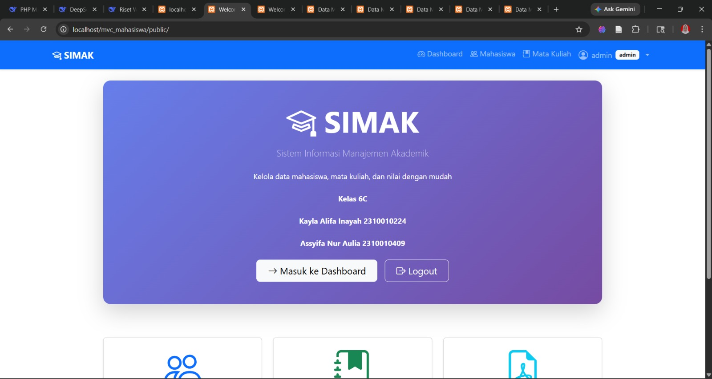

---

# Commit GitHub

```bash
git add .
git commit -m "Sesi 2 - routing dan base controller"
git push origin main
```

# SESI 4 - TAMBAH DATA MAHASISWA (CREATE)

## Tujuan
Membuat fitur tambah data mahasiswa menggunakan konsep MVC.

---

## Langkah Pengerjaan

### 1. Membuat Method create()
Menambahkan method `create()` pada file:

```bash
app/controllers/MahasiswaController.php
```

Method ini digunakan untuk menampilkan form tambah mahasiswa.

---

### 2. Membuat Method store()
Menambahkan method `store()` untuk:
- menerima data dari form
- validasi input
- menyimpan data ke database
- menampilkan flash message

---

### 3. Membuat Method create() pada Model
Menambahkan method:

```php
create($data)
```

pada file:

```bash
app/models/Mahasiswa.php
```

Method ini digunakan untuk menyimpan data mahasiswa menggunakan PDO.

---

### 4. Membuat Form Tambah Mahasiswa
Membuat file:

```bash
app/views/mahasiswa/create.php
```

Form berisi:
- npm
- nama lengkap
- fakultas
- jurusan
- tempat lahir
- tanggal lahir
- jenis kelamin

---

### 5. Menambahkan Tombol Tambah Mahasiswa
Menambahkan tombol:

```text
Tambah Mahasiswa
```

pada halaman data mahasiswa.

---

# Hasil Sesi 4

- Form tambah mahasiswa berhasil dibuat
- Data berhasil disimpan ke database
- Validasi berhasil berjalan
- Data baru berhasil tampil pada tabel mahasiswa

---

# Screenshot

## Form Tambah Mahasiswa

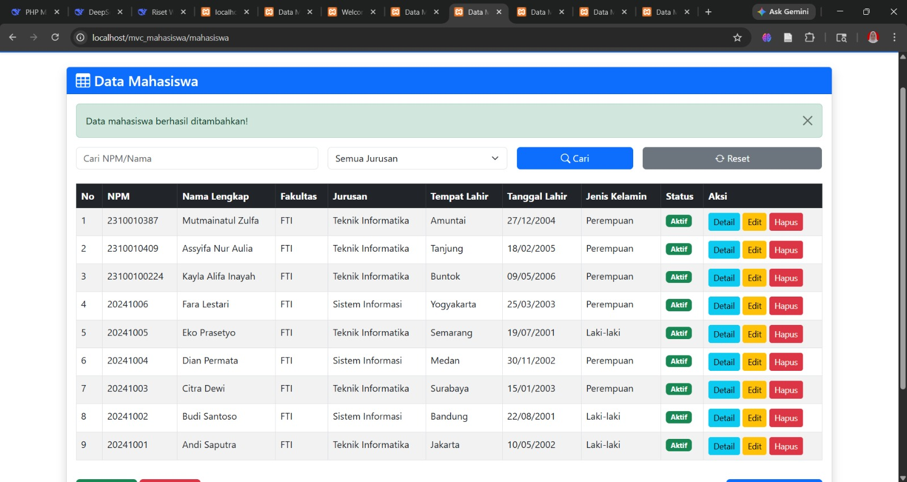

---

# URL Testing

```bash
http://localhost/mvc_mahasiswa_kelompok7/public/mahasiswa/create
```

---

# Commit GitHub

```bash
git add .
git commit -m "Sesi 4 - create mahasiswa"
git push origin main
```


# SESI 5 - EDIT DAN HAPUS DATA (UPDATE & DELETE)

## Tujuan
Menyelesaikan fitur CRUD dengan menambahkan edit dan hapus data mahasiswa.

---

## Langkah Pengerjaan

### 1. Membuat Method edit()
Menambahkan method:

```php
edit($id)
```

pada file:

```bash
app/controllers/MahasiswaController.php
```

Method ini digunakan untuk mengambil data mahasiswa berdasarkan id dan menampilkan form edit.

---

### 2. Membuat Method update()
Menambahkan method:

```php
update($id)
```

Method ini digunakan untuk:
- menerima data dari form edit
- validasi data
- memperbarui data mahasiswa di database

---

### 3. Membuat Method delete()
Menambahkan method:

```php
delete($id)
```

Method ini digunakan untuk menghapus data mahasiswa dari database.

---

### 4. Menambahkan Method pada Model
Menambahkan method:
- `find($id)`
- `update($id, $data)`
- `delete($id)`

pada file:

```bash
app/models/Mahasiswa.php
```

Method digunakan untuk mengambil, memperbarui, dan menghapus data mahasiswa menggunakan PDO.

---

### 5. Membuat View Edit
Membuat file:

```bash
app/views/mahasiswa/edit.php
```

Form edit berisi data lama yang dapat diperbarui.

---

### 6. Menambahkan Tombol Aksi
Menambahkan tombol:
- Edit
- Hapus

pada tabel data mahasiswa.

---

# Hasil Sesi 5

- Edit data mahasiswa berhasil berjalan
- Hapus data mahasiswa berhasil berjalan
- Data berhasil diperbarui
- Data berhasil dihapus dari database

---

# Screenshot

## Update Data Mahasiswa

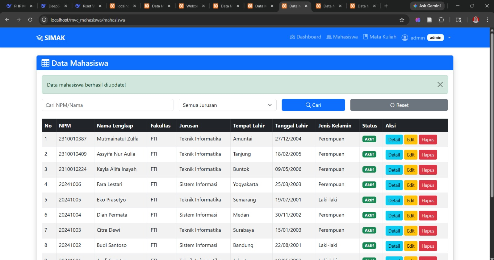

---

# Commit GitHub

```bash
git add .
git commit -m "Sesi 5 - update dan delete mahasiswa"
git push origin main
```

# SESI 6 - PENCARIAN DAN FILTER DATA

## Tujuan
Menambahkan fitur pencarian dan filter data mahasiswa berdasarkan nama, NPM, dan jurusan.

---

## Langkah Pengerjaan

### 1. Modifikasi Method index()
Memodifikasi method:

```php
index()
```

pada file:

```bash
app/controllers/MahasiswaController.php
```

Method digunakan untuk menerima parameter:
- search
- jurusan

menggunakan metode GET.

---

### 2. Membuat Method searchAndFilter()
Menambahkan method:

```php
searchAndFilter($search, $jurusan)
```

pada file:

```bash
app/models/Mahasiswa.php
```

Method digunakan untuk:
- mencari data berdasarkan nama atau NPM
- memfilter data berdasarkan jurusan
- menjalankan query dinamis menggunakan PDO

---

### 3. Membuat Form Pencarian
Menambahkan form pencarian pada halaman mahasiswa.

Form berisi:
- input pencarian
- dropdown jurusan
- tombol cari
- tombol reset

---

### 4. Menampilkan Hasil Filter
Data mahasiswa akan berubah sesuai:
- kata kunci pencarian
- jurusan yang dipilih

---

# Hasil Sesi 6

- Fitur pencarian berhasil berjalan
- Filter jurusan berhasil berjalan
- Data tabel berubah sesuai pencarian
- Tombol reset berhasil mengembalikan data awal

---

# Screenshot

## Pencarian dan Filter Data

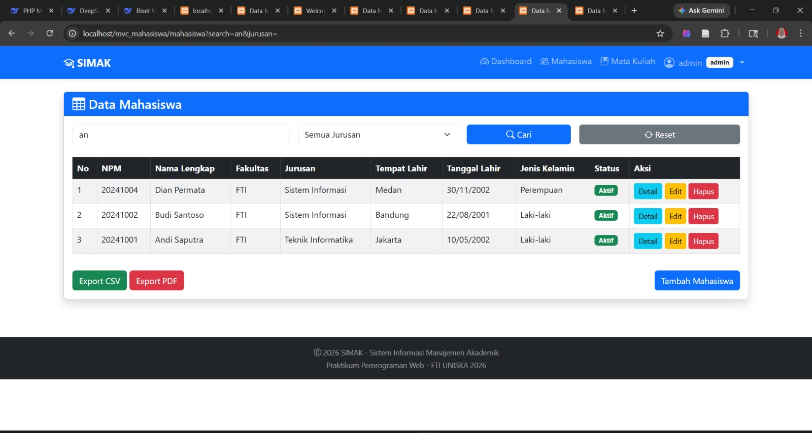

---

# Commit GitHub


# SESI 7 - LAYOUT DENGAN BOOTSTRAP & RESPONSIVE

## Tujuan
Membuat tampilan aplikasi menjadi lebih modern dan responsive menggunakan Bootstrap 5.

---

## Langkah Pengerjaan

### 1. Menggunakan Bootstrap 5
Mengintegrasikan Bootstrap 5 menggunakan CDN pada project MVC.

---

### 2. Membuat Layout Header
Membuat file:

```bash
app/views/layouts/header.php
```

Header digunakan untuk:
- membuka struktur HTML
- menampilkan navbar
- menghubungkan Bootstrap CSS

Navbar berisi menu:
- Home
- Data Mahasiswa
- Tambah Mahasiswa

---

### 3. Membuat Layout Footer
Membuat file:

```bash
app/views/layouts/footer.php
```

Footer digunakan untuk:
- menutup struktur HTML
- menghubungkan Bootstrap JavaScript

---

### 4. Modifikasi Base Controller
Memodifikasi method:

```php
view($view, $data = [])
```

pada file:

```bash
core/Controller.php
```

Agar seluruh halaman otomatis menggunakan:
- header
- footer
- layout Bootstrap

---

### 5. Menyesuaikan Tampilan View
Memperbarui seluruh halaman:
- home
- mahasiswa
- create
- edit

agar menggunakan class Bootstrap.

---

### 6. Menambahkan Styling Bootstrap
Menggunakan class:
- `table table-striped table-bordered`
- `form-control`
- `btn btn-primary`
- `alert alert-success`

untuk mempercantik tampilan aplikasi.

---

# Hasil Sesi 7

- Tampilan aplikasi menjadi lebih modern
- Layout responsive berhasil diterapkan
- Navbar berhasil ditampilkan
- Tabel dan form menjadi lebih rapi
- Seluruh halaman memiliki tampilan yang konsisten

---

# Screenshot

## Tampilan Bootstrap

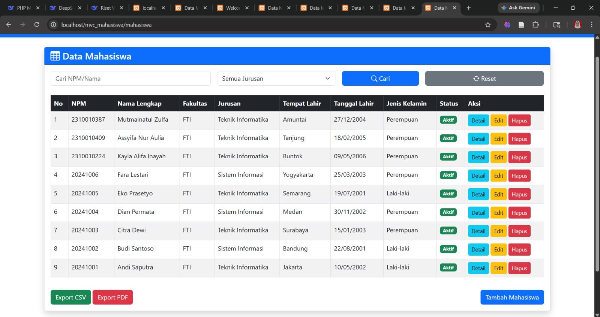

---

# Commit GitHub

```bash
git add .
git commit -m "Sesi 7 - bootstrap"
git push origin main
```
```bash
git add .
git commit -m "Sesi 6 - pencarian dan filter data"
git push origin main
```

# SESI 8 - EXPORT DATA DAN DOKUMENTASI AKHIR

## Tujuan
Menambahkan fitur export data ke CSV dan PDF serta menyelesaikan dokumentasi project.

---

## Langkah Pengerjaan

### 1. Membuat Export CSV
Menambahkan method:

```php
exportCSV()
```

pada file:

```bash
app/controllers/MahasiswaController.php
```

Method digunakan untuk:
- mengambil data mahasiswa
- membuat file CSV
- mengunduh data mahasiswa

---

### 2. Membuat Export PDF
Menambahkan method:

```php
exportPDF()
```

Menggunakan library:

```text
Dompdf
```

Method digunakan untuk:
- mengambil data mahasiswa
- membuat file PDF
- mengunduh data mahasiswa

---

### 3. Menambahkan Tombol Export
Menambahkan tombol:
- Export CSV
- Export PDF

pada halaman data mahasiswa.

---

### 4. Menyelesaikan Dokumentasi
Membuat file:

```bash
README.md
```

Dokumentasi berisi:
- penjelasan project
- fitur aplikasi
- langkah menjalankan aplikasi
- screenshot setiap sesi
- repository GitHub

---

# Hasil Sesi 8

- Export CSV berhasil berjalan
- Export PDF berhasil berjalan
- File berhasil diunduh
- Dokumentasi project berhasil dibuat
- Seluruh fitur aplikasi berhasil diselesaikan

---

# Screenshot

## Hasil Akhir Project

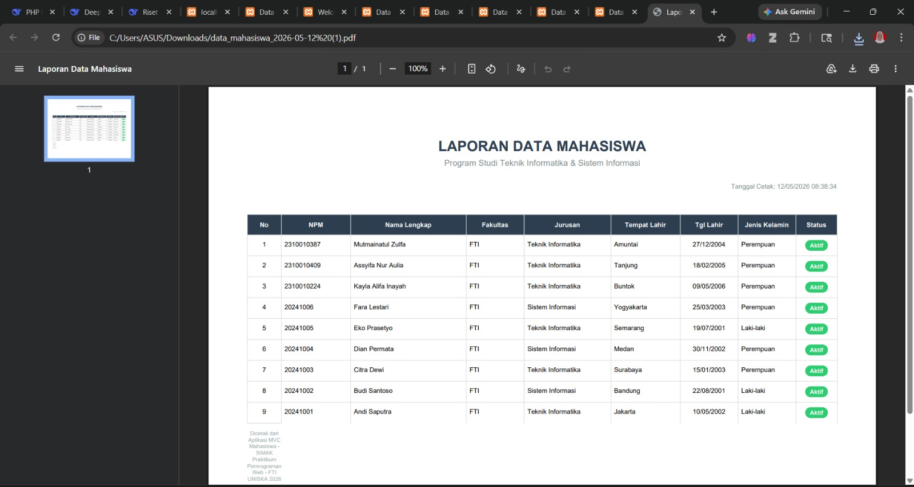

## Hasil Export Excel

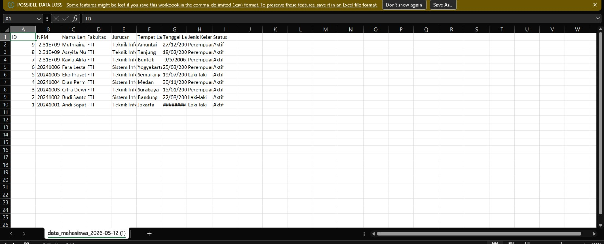

---

# Commit GitHub

```bash
git add .
git commit -m "Sesi 8 - export data dan dokumentasi akhir"
git push origin main
```


# TUGAS AKHIR - OPSI 1 LOGIN ADMIN & USER

## Tujuan
Menambahkan sistem autentikasi login dengan role Admin dan User pada aplikasi MVC Mahasiswa.

---

# Fitur Login

## Login Admin
Admin memiliki hak akses:
- tambah data mahasiswa
- edit data mahasiswa
- hapus data mahasiswa
- export data

Setelah berhasil login, admin akan diarahkan ke halaman dashboard/data mahasiswa dengan tampilan menu lengkap.

---

## Login User
User hanya memiliki akses terbatas, yaitu:
- melihat data mahasiswa
- mencari data mahasiswa
- melihat detail data

User tidak dapat menambah, mengedit, maupun menghapus data.

---

## Login dengan Google
Aplikasi juga menyediakan fitur login menggunakan akun Google untuk mempermudah proses autentikasi pengguna.

Dengan fitur ini, pengguna dapat login tanpa perlu memasukkan username dan password secara manual.

---

## Session dan Hak Akses
Sistem menggunakan session login untuk:
- menyimpan status pengguna
- membedakan role admin dan user
- membatasi akses halaman tertentu

Jika user belum login, maka sistem akan mengarahkan pengguna ke halaman login terlebih dahulu.

---

# Langkah Pengerjaan

### 1. Membuat AuthController
Membuat file:

```bash
app/controllers/AuthController.php
```

Controller digunakan untuk:
- login
- logout
- validasi user
- session login

---

### 2. Membuat Tabel User
Membuat tabel:

```sql
users
```

Data tabel:
- id
- username
- password
- role
- nama_lengkap

---

### 3. Membuat Middleware Session
Menambahkan pengecekan session untuk membatasi akses halaman berdasarkan role user.

---

### 4. Membuat Halaman Login
Membuat file:

```bash
app/views/auth/login.php
```

Halaman login menggunakan Bootstrap dengan tampilan responsive.

---

### 5. Membuat Role Admin dan User
Role:
- admin
- user

Hak akses dibedakan berdasarkan session login.

---

# Hasil Tugas Akhir

- Login admin berhasil berjalan
- Login user berhasil berjalan
- Session login berhasil berjalan
- Hak akses admin dan user berhasil dibedakan
- Login Google berhasil ditampilkan
- Tampilan aplikasi menjadi lebih aman dan modern

---

# Screenshot

## Halaman Login

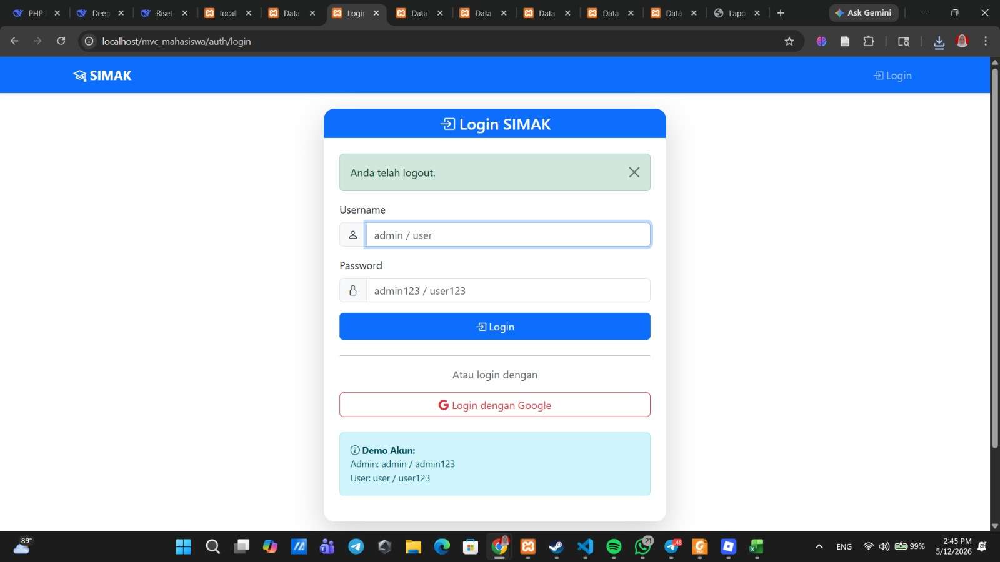

## Login Admin Berhasil

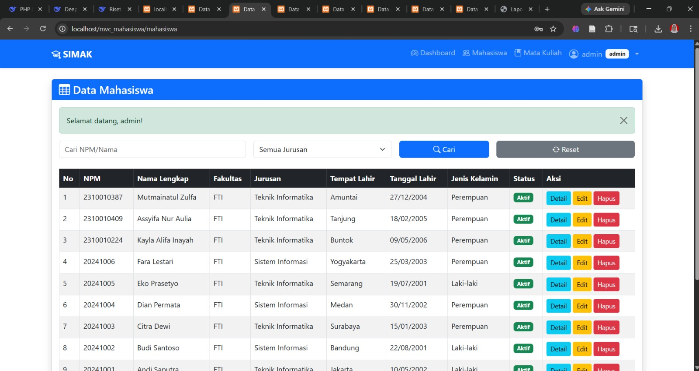

## Login User Berhasil

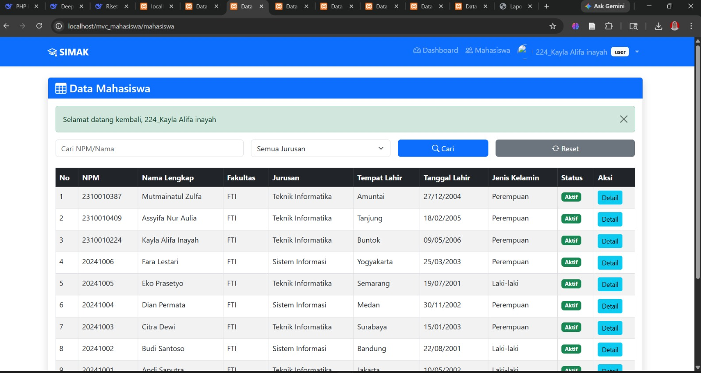

---

# Commit GitHub

```bash
git add .
git commit -m "Tugas akhir - opsi 1 login admin dan user"
git push origin main
```


# TUGAS AKHIR - OPSI 2 REST API MAHASISWA

## Tujuan
Menambahkan REST API pada aplikasi MVC Mahasiswa agar data dapat diakses menggunakan format JSON.

---

# Penjelasan REST API

REST API digunakan untuk menghubungkan aplikasi dengan sistem lain melalui endpoint tertentu.

Pada project ini, API digunakan untuk:
- menampilkan data mahasiswa
- menambah data mahasiswa
- mengubah data mahasiswa
- menghapus data mahasiswa

Semua data dikirim menggunakan format:

```json
JSON
```

---

# Endpoint API

## GET Data Mahasiswa

```bash
/api/mahasiswa
```

Digunakan untuk menampilkan seluruh data mahasiswa.

---

## GET Detail Mahasiswa

```bash
/api/mahasiswa/{id}
```

Digunakan untuk menampilkan detail mahasiswa berdasarkan id.

---

## POST Tambah Data

```bash
/api/mahasiswa/store
```

Digunakan untuk menambahkan data mahasiswa baru.

---

## PUT Update Data

```bash
/api/mahasiswa/update/{id}
```

Digunakan untuk memperbarui data mahasiswa.

---

## DELETE Hapus Data

```bash
/api/mahasiswa/delete/{id}
```

Digunakan untuk menghapus data mahasiswa.

---

# Langkah Pengerjaan

### 1. Membuat ApiController
Membuat file:

```bash
app/controllers/ApiController.php
```

Controller digunakan untuk menangani request API dan mengembalikan response JSON.

---

### 2. Membuat Response JSON
Menggunakan:

```php
json_encode()
```

untuk mengubah data menjadi format JSON.

---

### 3. Menambahkan Routing API
Menambahkan route API pada file routing aplikasi.

---

### 4. Menghubungkan dengan Database
API dihubungkan dengan model mahasiswa untuk mengambil data dari database.

---

# Hasil Tugas Akhir

- API berhasil menampilkan data mahasiswa
- API berhasil tambah data
- API berhasil update data
- API berhasil hapus data
- Response JSON berhasil tampil
- API dapat diuji menggunakan browser atau Postman

---

# Screenshot

## REST API Mahasiswa

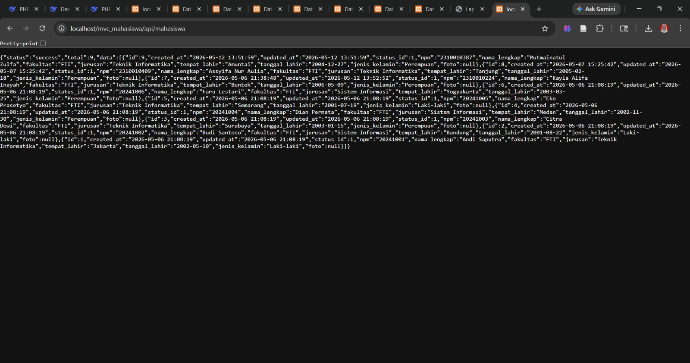

---

# Commit GitHub

```bash
git add .
git commit -m "Tugas akhir - opsi 2 - API"
git push origin main
```

# TUGAS AKHIR - OPSI 3 RELASI DATABASE

## Tujuan
Menambahkan relasi database antara data mahasiswa dan mata kuliah pada aplikasi MVC Mahasiswa.

---

# Penjelasan Relasi Database

Pada tugas akhir ini, aplikasi berhasil dikembangkan dengan menambahkan tabel mata kuliah dan relasi pengambilan mata kuliah oleh mahasiswa.

Relasi database digunakan agar:
- mahasiswa dapat mengambil beberapa mata kuliah
- data menjadi lebih terstruktur
- sistem lebih mendekati implementasi akademik sebenarnya

---

# Tabel Database

## Tabel Mahasiswa
Berisi data mahasiswa:
- npm
- nama lengkap
- jurusan
- tanggal lahir
- jenis kelamin

---

## Tabel Mata Kuliah
Berisi data mata kuliah:
- kode mata kuliah
- nama mata kuliah
- jumlah SKS

---

## Tabel Ambil Mata Kuliah
Tabel relasi yang menghubungkan:
- mahasiswa
- mata kuliah

Sehingga satu mahasiswa dapat mengambil banyak mata kuliah.

---

# Langkah Pengerjaan

### 1. Membuat Tabel Mata Kuliah
Membuat tabel:

```sql
mata_kuliah
```

untuk menyimpan data mata kuliah.

---

### 2. Membuat Tabel Relasi
Membuat tabel:

```sql
ambil_mk
```

untuk menghubungkan mahasiswa dengan mata kuliah.

---

### 3. Membuat Model Mata Kuliah
Membuat file:

```bash
app/models/MataKuliah.php
```

Model digunakan untuk mengambil dan menyimpan data mata kuliah.

---

### 4. Membuat Controller Mata Kuliah
Membuat file:

```bash
app/controllers/MataKuliahController.php
```

Controller digunakan untuk:
- menampilkan data mata kuliah
- menambah mata kuliah
- menghubungkan mahasiswa dengan mata kuliah

---

### 5. Membuat Tampilan Mata Kuliah
Membuat halaman:
- daftar mata kuliah
- form tambah mata kuliah
- relasi mahasiswa dan mata kuliah

---

# Hasil Tugas Akhir

- Tabel mata kuliah berhasil dibuat
- Relasi mahasiswa dan mata kuliah berhasil berjalan
- Data mata kuliah berhasil ditambahkan
- Sistem akademik menjadi lebih lengkap
- Data relasi berhasil tampil pada aplikasi

---

# Screenshot

## Tambah Mata Kuliah

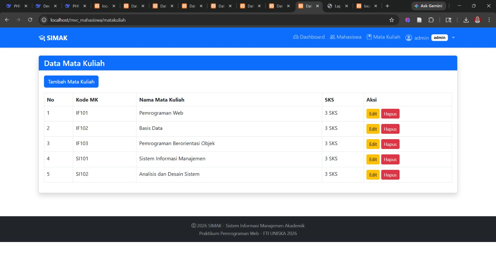

## Hasil Relasi Database

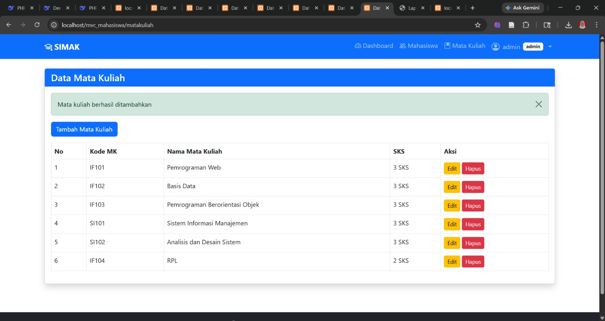

---

# Commit GitHub

```bash
git add .
git commit -m "Tugas akhir - opsi 3 relasi database"
git push origin main
```

## Opsi 4 – Dashboard Statistik Mahasiswa

Pada opsi ini dilakukan pembuatan halaman dashboard untuk menampilkan ringkasan data akademik secara visual dan informatif. Dashboard menampilkan jumlah mahasiswa, jumlah mata kuliah, status mahasiswa aktif dan nonaktif, serta grafik statistik mahasiswa per jurusan.

### Fitur pada Dashboard:
- Menampilkan total mahasiswa
- Menampilkan total mata kuliah
- Menampilkan jumlah mahasiswa aktif dan nonaktif
- Grafik statistik mahasiswa per jurusan
- Diagram status mahasiswa
- Statistik mahasiswa berdasarkan fakultas
- Grafik jenis kelamin mahasiswa
- Tampilan dashboard menggunakan Bootstrap dan Chart.js

### Screenshot Hasil Dashboard

#### Tampilan Dashboard Utama
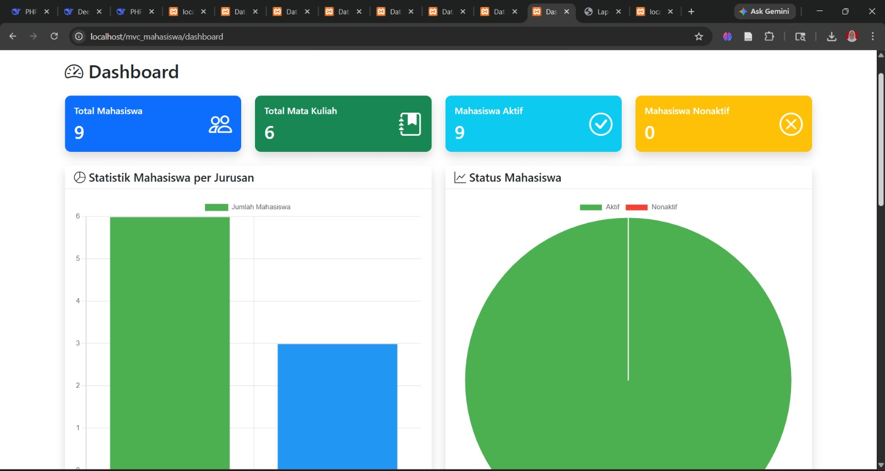

Halaman dashboard utama berhasil menampilkan ringkasan data akademik secara realtime dalam bentuk card statistik dan grafik visual.

#### Tampilan Statistik Dashboard
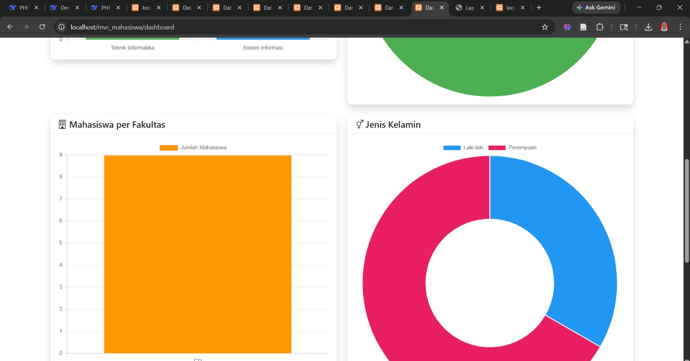

Dashboard juga menampilkan diagram statistik mahasiswa berdasarkan fakultas dan jenis kelamin sehingga informasi akademik dapat dipantau dengan lebih mudah dan interaktif.
